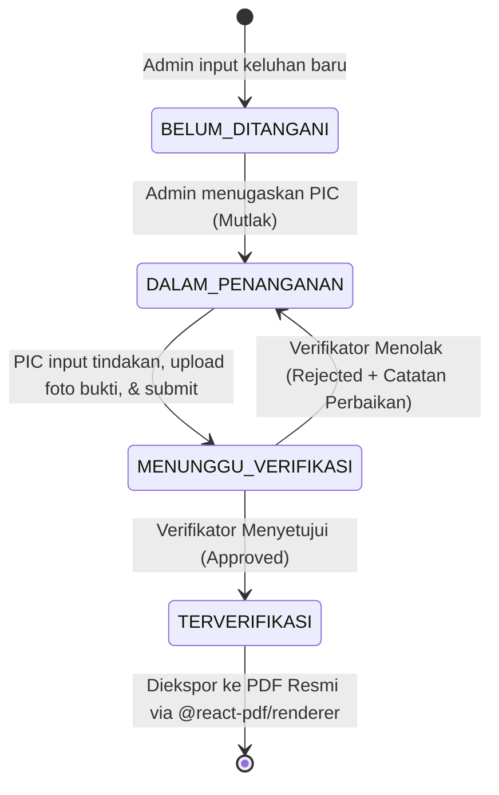

# SPKP - Sistem Penanganan Keluhan Pelanggan

> **Sistem Informasi Dokumentasi & Pengendalian Mutu Keluhan Pelanggan**  
> **PT Kereta Api Indonesia (Persero)** — Formulir Standar Kendali Mutu: `FR.SM/TI/033.001`

---

## 📌 Ringkasan Proyek

**SPKP (Sistem Penanganan Keluhan Pelanggan)** adalah aplikasi web terintegrasi yang dirancang khusus untuk mendokumentasikan, mengoordinasikan, dan memverifikasi tindak lanjut penanganan keluhan pengguna jasa kereta api secara transparan dan akuntabel.

Sistem ini difokuskan sebagai **media dokumentasi dan kendali mutu internal** dengan pembagian peran yang ketat (*Three-tier Role Separation*) dan kemampuan menghasilkan output laporan resmi berformat PDF berstandar KAI.

---

## 👥 Peran Pengguna (Roles & Responsibilities)

Sistem memiliki 3 tingkatan hak akses pengguna:

| Role | Identitas Aktor | Tanggung Jawab & Wewenang |
| :--- | :--- | :--- |
| **`ADMIN`** | Customer Service / Pengelola Sistem | • Mencatat keluhan baru yang masuk dari berbagai saluran (Telepon, Email, Survey, Loket Langsung, dll.).<br>• **Menentukan penugasan PIC secara mutlak** sesuai jenis keluhan.<br>• Mengelola data pokok keluhan dan memonitor dashboard rekapitulasi.<br>• Menerbitkan dokumen laporan resmi cetak/PDF (`FR.SM/TI/033.001`). |
| **`PIC`** | Petugas Lapangan / Eksekutor | • **Melihat seluruh keluhan** yang ada di dalam sistem guna pemantauan & koordinasi.<br>• **Hanya berwenang mengeksekusi keluhan yang ditugaskan kepada dirinya** oleh Admin.<br>• Mendokumentasikan **Tindakan Perbaikan (*Corrective Action*)** dan **Tindakan Pencegahan (*Preventive Action*)**.<br>• **Wajib mengunggah foto bukti hasil perbaikan** ke Supabase Storage sebelum mengajukan verifikasi.<br>• Mengajukan keluhan yang selesai ditangani ke tahap verifikasi (*Submit for Verification*). |
| **`VERIFIKATOR`** | Tim Kendali Mutu / Quality Assurance | • Memeriksa keabsahan dan efektivitas tindakan penanganan serta **meninjau foto bukti perbaikan** yang diajukan oleh PIC.<br>• Memberikan keputusan: **Disetujui (*Approved*)** atau **Ditolak (*Rejected*)**.<br>• Wajib menyertakan catatan evaluasi/feedback perbaikan jika keluhan ditolak agar ditangani ulang oleh PIC. |

---

## 🔄 Alur Status Keluhan (*Lifecycle State Machine*)



---

## 🛠️ Arsitektur & Teknologi

- **Frontend & App Framework:** [Next.js 14](https://nextjs.org/) (App Router, Server Components & Server Actions)
- **UI Library & Styling:** [React 18](https://react.dev/), [Tailwind CSS v3](https://tailwindcss.com/)
- **Autentikasi & Keamanan:** [Supabase Auth](https://supabase.com/docs/guides/auth) via `@supabase/ssr` (Cookie-based Session, Server-side JWT Verification via `getUser()`, Protected Middleware)
- **Penyimpanan Berkas (Storage):** [Supabase Storage](https://supabase.com/docs/guides/storage) (Bucket: `complaint-proofs` untuk foto bukti perbaikan lapangan)
- **Database & Query:** [PostgreSQL](https://www.postgresql.org/) di Supabase Cloud & [Prisma ORM v5](https://www.prisma.io/)
- **Dokumen & PDF Export:** [@react-pdf/renderer](https://react-pdf.org/) (Menghasilkan berkas PDF A4 Landscape standar KAI `FR.SM/TI/033.001` secara presisi dan dapat diunduh langsung di peramban)
- **Bahasa Pemrograman:** [TypeScript](https://www.typescriptlang.org/) (Strict Mode)

---

## 📁 Struktur Direktori

```text
SPKP/
├── .agents/                    # Agent skills & konfigurasi IDE Antigravity
├── prisma/
│   ├── schema.prisma           # Skema database relasional (User, Complaint, Verification, Document)
│   └── seed.ts                 # Script seeding data awal staf dan contoh keluhan
├── src/
│   ├── app/
│   │   ├── actions/            # Next.js Server Actions (complaints.ts)
│   │   ├── auth/callback/      # Route handler penukaran kode sesi Supabase
│   │   ├── dashboard/          # Halaman portal utama sistem penanganan keluhan
│   │   ├── login/              # Halaman autentikasi kredensial staf
│   │   ├── layout.tsx          # Root layout aplikasi
│   │   └── page.tsx            # Redirect rute landing
│   ├── components/             # Komponen UI (DashboardClient, KaiDocumentModal, LogoutButton, dll.)
│   ├── lib/
│   │   ├── auth.ts             # Server auth helpers (getCurrentUser, requireUser)
│   │   ├── prisma.ts           # Instansiasi PrismaClient singleton
│   │   └── supabase/           # Modul Supabase terisolasi (client.ts, server.ts, admin.ts)
│   ├── middleware.ts           # Middleware proteksi rute & refresh sesi SSR Supabase
│   └── types/                  # Definisi antarmuka TypeScript
├── supabase/
│   ├── config.toml             # Konfigurasi proyek Supabase
│   └── migrations/             # Berkas migrasi database SQL (initial_schema.sql)
├── .env.example                # Template variabel lingkungan
├── package.json
└── README.md
```

---

## 🚀 Panduan Memulai (Instalasi & Menjalankan Lokal)

### 1. Prasyarat Sistem
- Node.js versi 18.17+ atau 20+
- Akun / Project di [Supabase](https://supabase.com/)

### 2. Kloning & Instalasi Dependensi
```bash
git clone <repository-url>
cd spkp
npm install
```

### 3. Konfigurasi Lingkungan (`.env`)
Salin berkas template lingkungan:
```bash
cp .env.example .env
```
Lengkapi nilai pada berkas `.env` sesuai kredensial proyek Supabase Anda:
```env
NEXT_PUBLIC_SUPABASE_URL=https://<your-project-ref>.supabase.co
NEXT_PUBLIC_SUPABASE_PUBLISHABLE_KEY=sbp_...
NEXT_SERVICE_ROLE_KEY=eyJ...
DATABASE_URL=postgresql://postgres.<ref>:<password>@aws-0-<region>.pooler.supabase.com:6543/postgres?pgbouncer=true
DIRECT_URL=postgresql://postgres.<ref>:<password>@aws-0-<region>.pooler.supabase.com:5432/postgres
```

### 4. Sinkronisasi Database & Seeding
Terapkan skema database dan jalankan pengisian data awal (*seeding* akun demo & sample keluhan):
```bash
npx prisma db push
npx prisma db seed
```

### 5. Jalankan Server Pengembangan
```bash
npm run dev
```
Buka browser dan akses alamat: [http://localhost:3001](http://localhost:3001).

---

## 🔑 Akun Demo Pengujian

Setelah menjalankan script seed, akun berikut siap digunakan:

| Role | Email | Password | Kegunaan Uji Coba |
| :--- | :--- | :--- | :--- |
| **Admin / CS** | `admin@spkp.kai.id` | `password123` | Registrasi keluhan, penugasan PIC, cetak laporan PDF |
| **PIC Lapangan** | `pic@spkp.kai.id` | `password123` | Input tindakan perbaikan & pencegahan, submit verifikasi |
| **Verifikator** | `verifikator@spkp.kai.id` | `password123` | Tinjau hasil PIC, approve atau reject keluhan |

*(Halaman login juga telah dilengkapi tombol **Quick Fill** untuk pengujian instan antar-peran).*

---

## 📄 Dokumen Spesifikasi Terkait
- [PRD.md](file:///c:/Users/novaa/OneDrive/Documents/MAGANG/SPKP/PRD.md) — *Product Requirements Document* lengkap
- [TODO.md](file:///c:/Users/novaa/OneDrive/Documents/MAGANG/SPKP/TODO.md) — Roadmap checklist pengembangan dan peningkatan fitur
